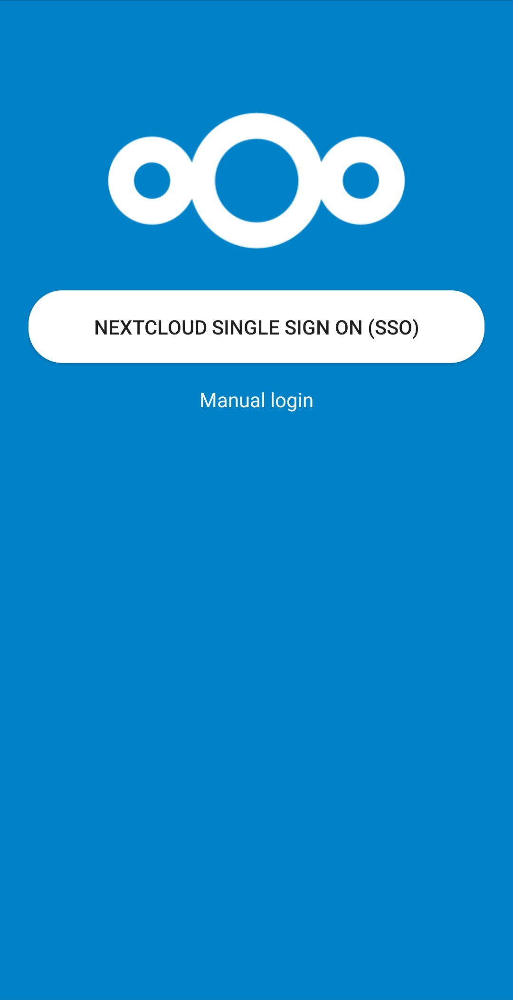

## :link: Nextcloud Bookmarks Android App

## :arrow_forward: Access
 

assets/nx/screenshots/shotsso.jpg
## :eyes: Screenshots

| Multiple Accounts | SSO | Tags |  Bookmarks |
| :--: | :--: | :--: | :--: |
|  |   |  |  |

## :rocket: Features

* Works offline 🔌
* Mark bookmarks as favorite Organize your bookmarks with labels 🔖
* Manage tags 🏷
* Translated in many languages 🌎
* Multiple accounts
* SSO : Nextcloud Single Sign On (WIP)

An Android front end for the Nextcloud [Bookmark App](https://github.com/nextcloud/bookmarks/) 
based on the new [REST API](https://github.com/nextcloud/bookmarks/#rest-api) that was introduced
by NextCloudBookmarks version [0.10.1](https://github.com/nextcloud/bookmarks/releases/tag/v0.10.1)
and ownCloudBookmarks version [0.10.2](https://marketplace.owncloud.com/apps/bookmarks)

## :checkered_flag: Planned features

* [Folder Structure](https://gitlab.com/bisada/OCBookmarks/issues/17)

## :family: Join the team

  * Test the app with different devices
  * Report issues in the [issue tracker](https://gitlab.com/bisada/OCBookmarks/issues)
  * [Pick a good first issue](https://github.com/nextcloud/server/labels/good%20first%20issue) :notebook:
  * Create a [Pull Request](https://opensource.guide/how-to-contribute/#opening-a-pull-request)
  * Buy this app on [Google Play Store](https://play.google.com/store/apps/details?id=org.bisw.nxbookmarks)
  * Send me a bottle of your favorite beer :beers: :wink:

## :link: Issues
* Please note we have identified Some issues. Please look at [Issue board](https://gitlab.com/bisada/OCBookmarks/issues) before review.
* Feel free to send us a pull request.
## :link: Maintainer
* [Biswajit Das](https://gitlab.com/bisasda):@bisasda

## :link: How to compile the App

## :label: Requirements:
-------------
  1. Android Studio

:arrow_down_small: Download and install:

  1. Open cmd/terminal
  2. Navigate to your workspace
  3. Then type in: `git clone https://gitlab.com/bisada/OCBookmarks.git`
  4. Import the Project in Android Studio and start coding!

## :link: Contributors
* [Biswajit Das](https://gitlab.com/bisasda):@bisasda
* [Christian Schabesberger](https://gitlab.com/derSchabi):@derSchabi

## :link: Requirements
* [Nextcloud](https://nextcloud.com/) instance running.
* [Nextcloud Android](https://github.com/nextcloud/android) app installed (> 3.9.0)
* [Nextcloud Bookmark](https://github.com/nextcloud/bookmarks) app enabled on Instances

## :link: Contributions
* All pull requests are welcome.

