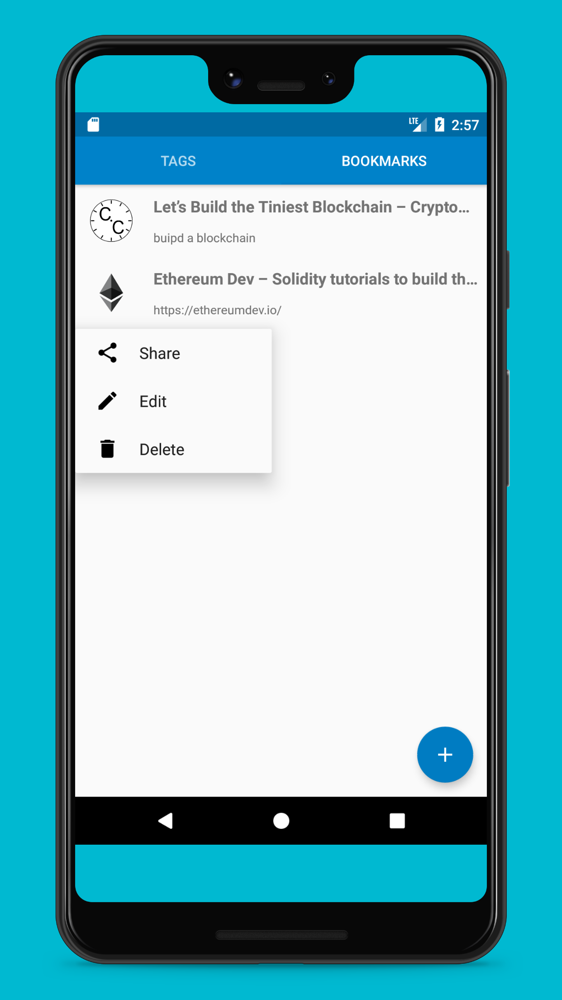

## :link: Nextcloud Bookmarks Android App

## :arrow_forward: Access
 

## :eyes: Screenshots

| Multiple Accounts | SSO | Tags |  Bookmarks |
| :--: | :--: | :--: | :--: |
|  |   |  |  |

## :rocket: Features

* Works offline 🔌
* Mark bookmarks as favorite Organize your bookmarks with labels 🔖
* Manage tags 🏷
* Translated in many languages 🌎
* Multiple accounts
* SSO : Nextcloud Single Sign On

An Android front end for the Nextcloud [Bookmark App](https://github.com/nextcloud/bookmarks/) 
based on the new [REST API](https://github.com/nextcloud/bookmarks/#rest-api) that was introduced
by NextCloudBookmarks version [3.2.1](https://github.com/nextcloud/bookmarks/releases/tag/v3.2.1)

## :checkered_flag: Planned features

* [Folder Structure](https://gitlab.com/bisada/OCBookmarks/issues/17)

## :family: Join the team

  * Test the app with different devices
  * Report issues in the [issue tracker](https://gitlab.com/bisada/OCBookmarks/issues)
  * [Pick an issue](https://gitlab.com/bisada/OCBookmarks/-/issues?label_name%5B%5D=help+wanted) :notebook:
  * Create a [Pull Request](https://opensource.guide/how-to-contribute/#opening-a-pull-request)
  * Buy this app on [Amazon App Store](https://www.amazon.com/dp/B08L5RKHMM/ref=apps_sf_sta)
  * Send me a bottle of your favorite beer :beers: :wink:
  * 

## :link: Issues
* Please note we have identified Some issues. Please look at [Issue board](https://gitlab.com/bisada/OCBookmarks/issues) before review.
* Feel free to send us a pull request.
## :link: Maintainer
* [Biswajit Das](https://gitlab.com/bisasda):@bisasda

## :link: How to compile the App

## :label: Requirements:
-------------
  1. Android Studio

:arrow_down_small: Download and install:

  1. Open cmd/terminal
  2. Navigate to your workspace
  3. Then type in: `git clone https://gitlab.com/bisada/OCBookmarks.git`
  4. Import the Project in Android Studio and start coding!

## :link: Contributors
* [Biswajit Das](https://gitlab.com/bisasda):@bisasda
* [Christian Schabesberger](https://gitlab.com/derSchabi):@derSchabi

## :link: Requirements
* [Nextcloud](https://nextcloud.com/) instance running.
* [Nextcloud Android](https://github.com/nextcloud/android) app installed (> 3.9.0)
* [Nextcloud Bookmark](https://github.com/nextcloud/bookmarks) app enabled on Instances

# :link: Testing: Nextcloud Bookmarks Android App testing Guide

### Prerequisites

* You should have nextcloud instances access
* NextCloud Bookmarks version [3.2.1](https://github.com/nextcloud/bookmarks/releases/tag/v3.2.1) should be installed.

### Login to Bookmark App

 * Open the Android App "Nextcloud Bookmarks"
 * **Step 1:** Click on **Nextcloud Singn on (SSO)**.
 * **Step 2:** Register the Nextcoud app for sso: 
    * Enter the "server address" in the field. Eg: https://us.cloudamo.com/
    * Enter the Username in the **user name** field. eg. email id(biswajitxxxxxxxx@nextcloud.com)
    * Enter the credentials **Password** field.
    * Finally click on **SIGN IN** button.
    * Once added select the account to continue.
 * **Step 3:** It will open the **BOOKMARKS** screen
 * **Step 4:** Click on the **TAGS** tab to open TAGS screen.

| Step 1 SSO Login | Step 2 Select account | Step 3 Bookmarks screen |  Step 4 Tags Screen |
| :--: | :--: | :--: | :--: |
|  |   |  |  |

### ADD New BookMark

* **Add Bookmarks:** To add New **bookmark** / **Tag** Click on the **+** (plus sign)
    * Add the intended url in **URL** field. Eg: https://www.youtube.com/user/Computerap
    * Add some meaningfull Title or Description.
    * Click on **+** (plus button) to add Tags to it. Eg. **youtube** . You can add multiple tags if you want.
    * Hit the **SAVE** button to add the **Bookmarks**.

| Add Bookmarks screen |
| :--: |
|  |

### EDIT/Delete Bookmark/Tags

*  **Edit/Delete:** To edit or delete Bookmarks please long press on the **Bookmarks** or **Tags** this will open EDIT/DELETE/SHARE window.

| Edit/Delete screen |
| :--: |
|  |

## :link: Contributions
* All pull requests are welcome.

