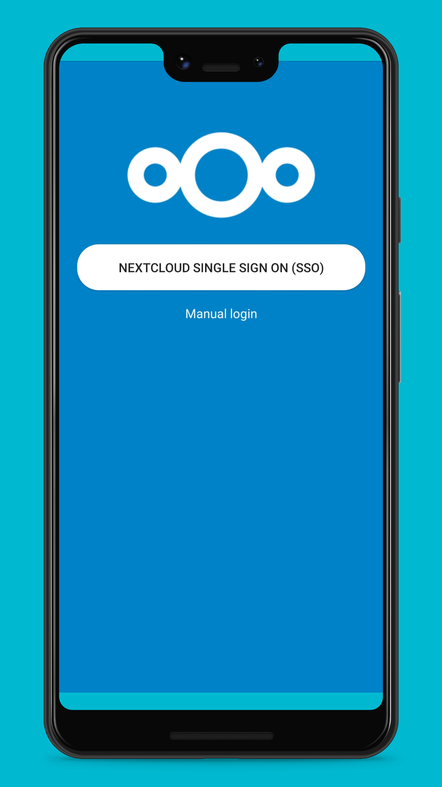
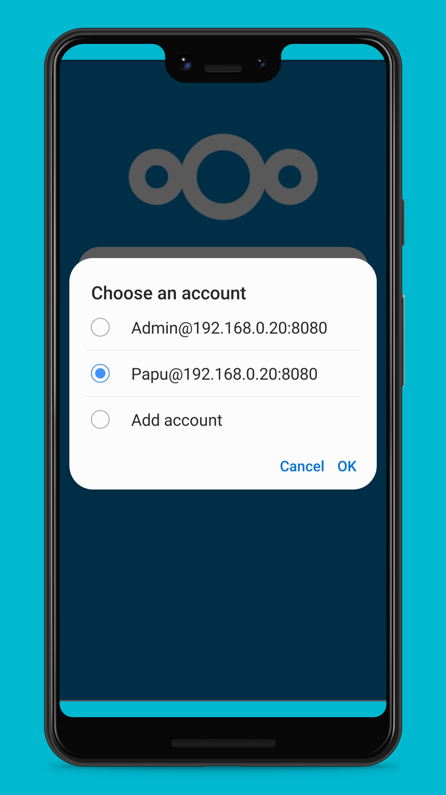
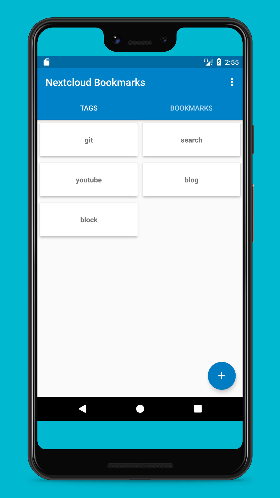
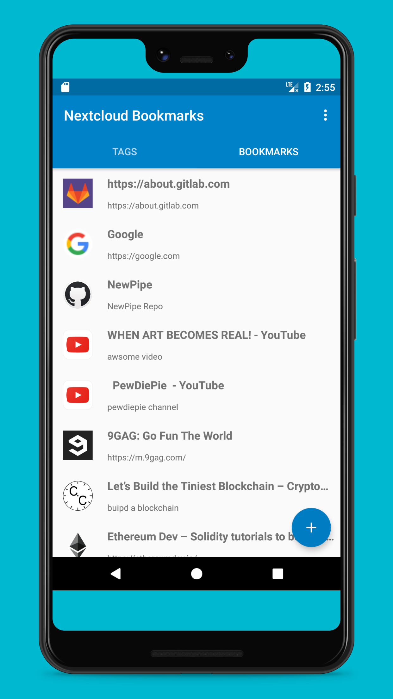
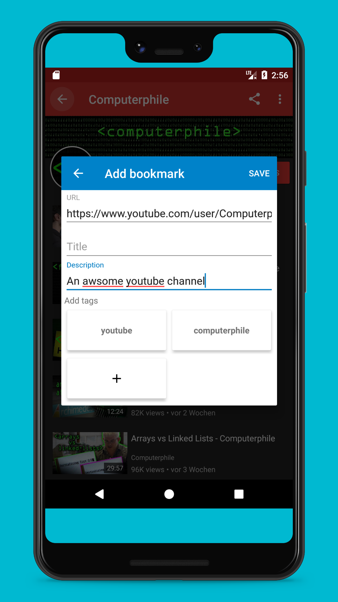
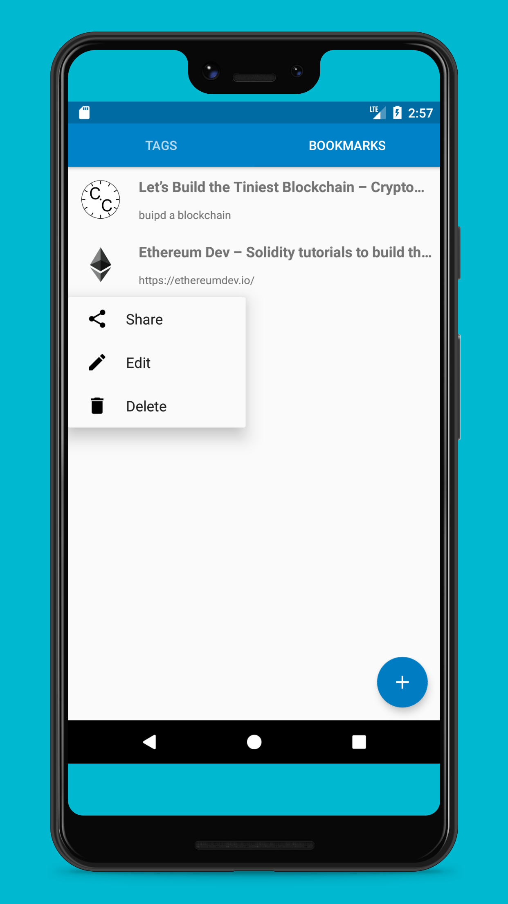

# :link: Testing: Nextcloud Bookmarks Android App testing Guide

### Prerequisites

* You should have nextcloud instances access
* NextCloud Bookmarks version [3.2.1](https://github.com/nextcloud/bookmarks/releases/tag/v3.2.1) should be installed.
* you need to install the **Android client** from bookmark v1.19 onwards. This is to supprt nextcloud ecosystem. It can be downloaded from Github, Playstore or f-droid.

**Github release**: https://github.com/nextcloud/android/releases then select stable release like: https://github.com/nextcloud/android/releases/download/stable-3.24.0/nextcloud-30240090.apk

### Login and register to Nextcloud android App

* **Step 1:** Install the Nextcloud Synchronization client
* **Step 2:** Register the Nextcoud account for sso: 
    * Enter the "server address" in the field. Eg: https://cloud.disroot.org/
    * Enter the Username in the **user name** field. eg. email id(xxxxxxxx@nextcloud.com)
    * Enter the credentials **Password** field.
    * Finally click on **SIGN IN** button.

* **Step 3** Once account added select the **disroot** account to load the app.
* **Step 3** Close the app.

### Login to Bookmark App

 * Open the Android App "Nextcloud Bookmarks"
 * **Step 1:** Click on **Nextcloud Singn on (SSO)**.
 * **Step 2:** select the **disroot user** account to continue.
 * **Step 3:** It will ask to add permission. Select "yes".
 * **Step 3:** It will open the **BOOKMARKS** screen
 * **Step 4:** Click on the **TAGS** tab to open TAGS screen.

| Step 1 SSO Login | Step 2 Select account | Step 3 Bookmarks screen |  Step 4 Tags Screen |
| :--: | :--: | :--: | :--: |
|  |   |  |  |

### ADD New BookMark

* **Add Bookmarks:** To add New **bookmark** / **Tag** Click on the **+** (plus sign)
    * Add the intended url in **URL** field. Eg: https://www.youtube.com/user/Computerap
    * Add some meaningfull Title or Description.
    * Click on **+** (plus button) to add Tags to it. Eg. **youtube** . You can add multiple tags if you want.
    * Hit the **SAVE** button to add the **Bookmarks**.

| Add Bookmarks screen |
| :--: |
|  |

### EDIT/Delete Bookmark/Tags

*  **Edit/Delete:** To edit or delete Bookmarks please long press on the **Bookmarks** or **Tags** this will open EDIT/DELETE/SHARE window.

| Edit/Delete screen |
| :--: |
|  |

